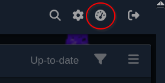
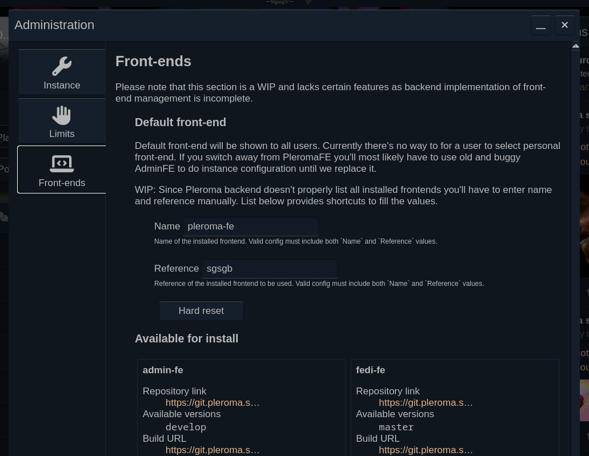
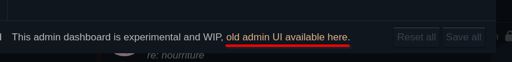
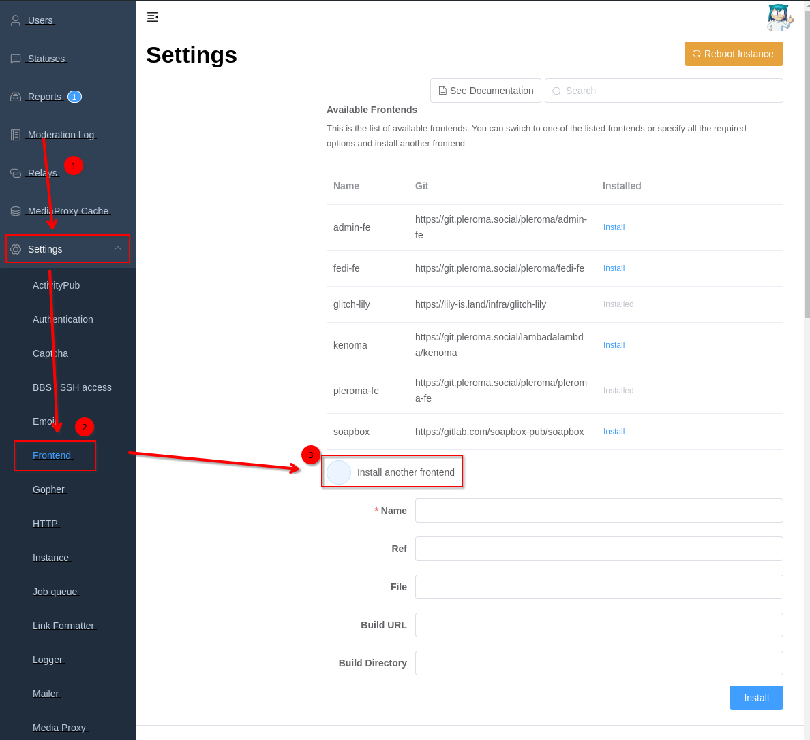
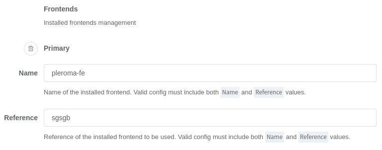

# Managing installed frontends

Pleroma lets you install multiple frontends including multiple versions of same frontend. Right now it's only possible to switch which frontend is the default, but in the future it would be possible for user to select which frontend they prefer to use.

As of 2.6.0 there are two ways of managing frontends - through PleromaFE's Admin Dashboard (preferred, easier method) or through AdminFE (clunky but also works on versions older than 2.6.0).

!!! note
    Managing frontends through UI requires [in-database configuration](../configuration/howto_database_config.md) to be enabled (default on newer instances but might be off on older ones).

## How it works

When installing frontends, it creates a folder in [static directory](../configuration/static_dir.md) that follows this pattern: `/frontends/${front-end name}/${front-end version}/`, puts contents of the built frontend in there. Then when accessing the server backend checks what front-end name and version are set to be default and serves index.html and assets from appropriate path.

!!! warning

    If you've been putting your frontend build directly into static dir as an antiquated way of serving custom frontend, this system will not work and will still serve the custom index.html you put in there. You can still serve custom frontend builds if you put your build into `/frontends/$name/$version` instead and set the "default frontend" fields appropriately.
    
Currently, there is no backup system, i.e. when installing `master` version it _will_ overwrite installed `master` version, for now if you want to keep previous version you should back it up manually, i.e. running `cp -r ./frontends/pleroma-fe/master ./frontends/pleroma-fe/master_old` in your static dir.

## Managing front-ends through Admin Dashboard

Open up Admin Dashboard (gauge icon in top bar, same as where link to AdminFE was),__

switch to "Front-ends" tab.  

This page is designed to be self-explanatory and easy to use, while avoiding issues and pitfalls of AdminFE, but it's also early in development, everything is subject to change.

!!! warning
    This goes without saying, but if you set default frontend to anything except >2.6.0 version of PleromaFE you'll lose the access to Admin Dashboard and will have to use AdminFE to get it back. See below on how to use AdminFE.

### Limitations 

Currently the list of available for install frontends is essentially hard-coded in backend's configuration, each providing only one version, with exception for PleromaFE which overrides 'pleroma-fe' to also include `develop` version. There is no way to manually install build with a URL (coming soon) nor add more available frontends to the repository (it's broken).

There is also no way to tell if there is an update available or not, for now you should watch for [announcements](https://pleroma.social/announcements/) of new PleromaFE stable releases to see if there is new stable version. For `develop` version it's up to you whether you want to follow the development process or just reinstall it periodically hoping for new stuff.

## Using AdminFE to manage frontends

Access AdminFE either directly by going to `/pleroma/admin` of your instance or by opening Admin Dashboard and clicking the link at the bottom of the window  

Go to Settings -> Frontend.

### Installing front-ends

At the very top of the page there's a list of available frontends and button to install custom front-end

!!! tip
    Remember to click "Submit" in bottom right corner to save your changes!

!!! bug
    **Available Frontends** section lets you _install_ frontends but **NOT** update/reinstall them. It's only useful for installing a frontend once.
    
Due to aforementioned bug, preferred way of installing frontends in AdminFE is by clicking the "Install another frontend"  

and filling in the fields. Unfortunately AdminFE does not provide the raw data necessary for you to fill those fields, so your best bet is to see what backend returns in browser's devtools or refer to the [source code](https://git.pleroma.social/pleroma/pleroma/-/blob/develop/config/config.exs?ref_type=heads#L742-791). For the most part, only **Name**, **Ref** (i.e. version) and **Build URL** fields are required, although some frontends might also require **Build Directory** to work. 

For pleroma-fe you can use either `master` or `develop` refs, or potentially any ref in GitLab that has artifacts for `build` job, but that's outside scope of this document.

### Selecting default frontend

Scroll page waaaaay down, search for "Frontends" section, subtitled "Installed frontends management", change the name and reference of the "Primary" frontend.  

!!! danger
    If you change "Admin" frontend name/reference you risk losing access to AdminFE as well.
    
!!! warning
    Don't put anything into the "Available" section as it will break the list of available frontends completely, including the "add another frontend" button. If you accidentally put something in there, click the trashbin icon next to "Available" to reset it and restore the frontends list.
